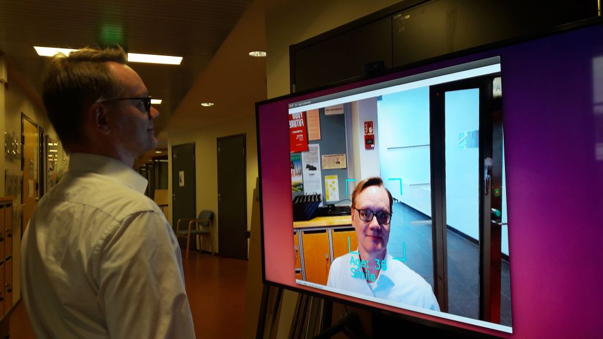
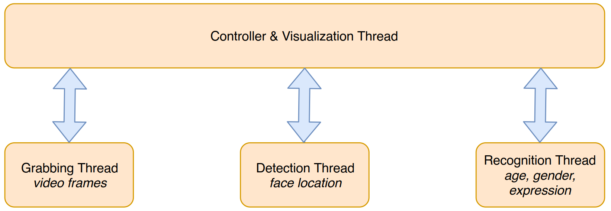

# TUT-live-age-estimator
Python implementation of a live deep learning based age/gender/expression recognizer.

<b>2018-09-18</b>: Updated detection and recognition to use modern Mobilenets through OpenCV and Keras, removed Caffe dependencies. Aligner updated. Other minor changes.

  The system in a test environment 
  

  

  System architecture 
  

<b>Usage instructions: </b>

Requires a webcam. 
Pip-package "opencv-python" includes GTK support, which is required. 
Keras 2.2.2. Earlier versions have a slightly different way of loading the models. 
Download the required deep learning models from <a href="https://tutfi-my.sharepoint.com/:u:/g/personal/janne_tommola_tut_fi/EcrQbRgnsydApRFsmsUbPfABcEK0arXtCe796Bt1x7_U7g?e=fQJN7Z">here</a>.

Example video of <b>old version</b> <a href="https://youtu.be/Kfe5hKNwrCU">here</a>.

